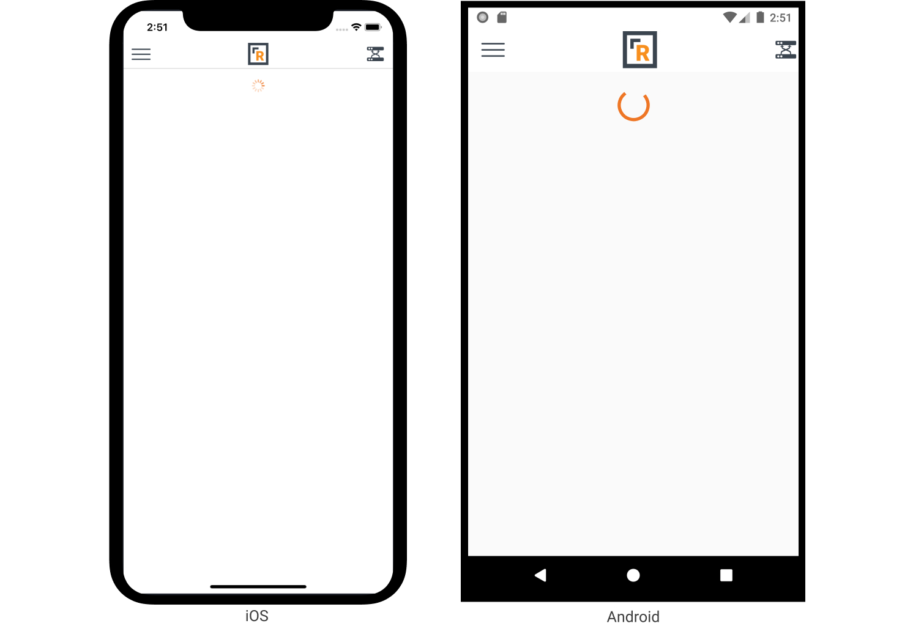

# Activity Indicator

_Inherits from_ [_Xamarin.Forms.ContentView_](https://docs.microsoft.com/en-us/dotnet/api/xamarin.forms.contentview)

Sometimes things take a moment to load. You don't want to just display a big white screen for the user to stare at, you want them to know we're working hard for them. That said, usually you are not going to be instantiating this view directly. But just in case you want to, here you go.

The ActivityIndicator will begin "working" when it becomes visible on screen. Initially, it will not show anything. Once a built-in timer elapses \(350ms\) then the actual indicator becomes visible. Your user will not care if it takes your page a few hundred milliseconds to load so there is no need to show them a spinning wheel right away.

**Properties**

| Property | Type | Description |
| :--- | :--- | :--- |
| IsVisible | bool | If `true` then the activity indicator will be visible and show that work is being done. |

**Example**

```text
<Rock:ActivityIndicator />
```



