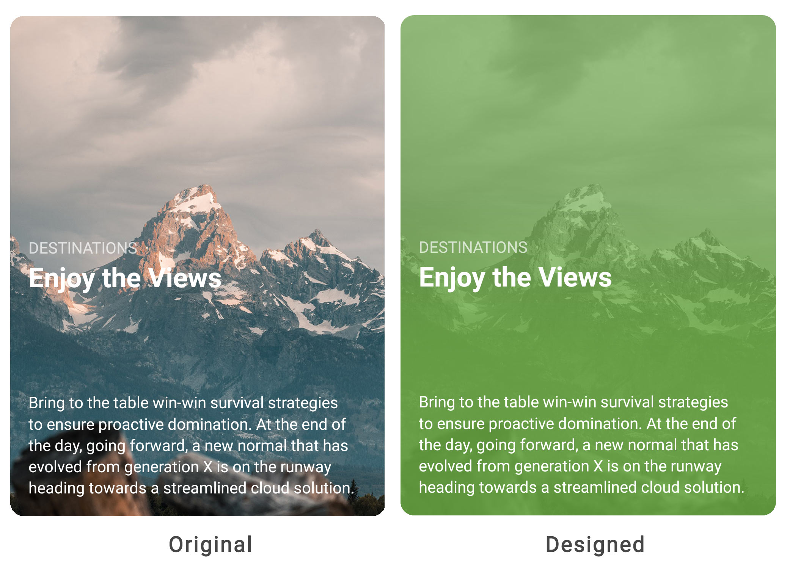

# Masks for Cards

The goal of any content strategy should be extensibility. To achieve rich designs you need images that are crafted for each medium and use-case. But, you don't want to spend time having to creating different variations of each image. To assist with that we've designed in a powerful masking system for cards. This helps to reduce the number of images you need to make for your mobile applications.

The concept of masks for cards is very similar to how masks work on images. The difference is much of the heavy lifting is done for you. You just need to remember a few simple properties. These properties vary a bit by card type. 

For cards of type Block and Contains the mask is places on the image while the mask for Inline is placed over the entire card. This makes sense as the image on an Inline card takes up the full background.

| Use | Description | Property Name \(Block and Contained\) | Property Name \(Inline\) |
| :--- | :--- | :--- | :--- |
| **Mask** | This is the location of the mask image. You can either provided your own via a URL or take advantage of the masks that our built into the application \(recommended\) | ImageMask | CardMask |
| **Opacity** | The opacity of the mask. | ImageMaskOpactity | CardMaskOpacity |
| **Color** | The color to overlay the mask. | ImageMaskColor | CardMaskColor |

## Built In Masks

While you can provide your own masks via a URL, you can save load time and bandwidth by using one of the built in masks. These are highlighted below.


These five masks give you several different options to start from. Adjusting the mask opacity and color gives you many more ways to design. You can also append `-Flip` to the end of the mask name to flip the mask 180 degrees. So if you wanted a light fade flipped use `Fade-Light-Flip`.

## Designing With Masks

As you set out to design with masks keep in mind that the best designs will be a recipe that incorporates the properties of the card, image and mask. Take for example the design below. The effect of the card comes from the card's background, the effects on the image as well as the mask.



```text
<Rock:InlineCard 
        CardRatio="4:3"
        Title="Enjoy the Views"
        HeaderLocation="Center"
        ContentLocation="Bottom"
        Tagline="DESTINATIONS"
        Image="https://yourserver.com/image-grandtetonfence.jpg"
        ImageSaturation="0"
        ImageOpacity=".4"
        BackgroundColor="#6bac43"
        BackgroundMask="Midline"
        BackgroundMaskColor="#6bac43"
        BackgroundMaskOpacity=".6">
        Bring to the table win-win survival strategies... 
 </Rock:InlineCard>
```

