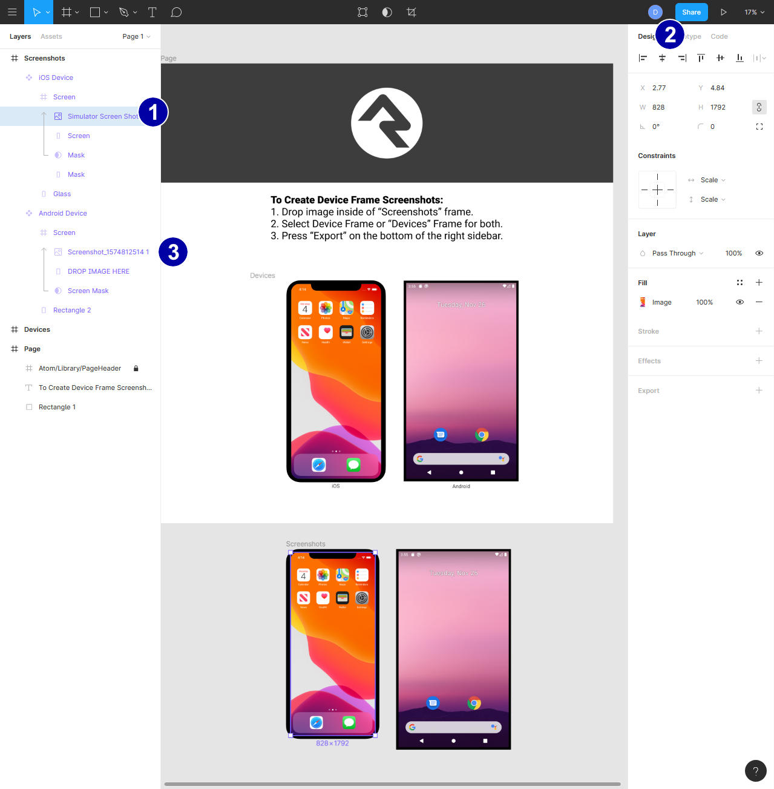

# Codex

We use the Figma service to generate screenshots. When you are ready to contribute screenshots for documentation you will need to create an accoun there. Once your account is setup you can go to this [link](https://www.figma.com/file/I4GTr4rmlRdNq1On63tfln/Device-Documentation-Screenshots/duplicate) to create your own personal screenshot template. You only need to visit it once, from then on just login to Figma and it will show in your personal templates, and if you accidentally mess it up, just delete it and visit the above link again.

All screenshots should be generated on both iOS and Android so that users can see the slight differences on each platform. On an iPhone, you should use the Simulator configured for an iPhone 11. For Android, we recommend a Pixel 2 - though any device that runs at 1080x1920 resolution will work. When using the iOS simulator, it must be run on the Mac directly. Using it through Visual Studio on a PC will result in an incorrect image as it will attempt to pre-apply the border mask.

Once you have your screenshots, drag the iOS screenshot into the bottom left device. Once it is in place, select the screenshot in the left-panel \(bubble 1 below\). Next center it horizontally and vertically using the center align buttons \(bubble 2 below\). Next drag your Android screenshot into the bottom right device. Again select it in the left-panel \(bubble 3 below\) and center it using the same buttons you used for the iOS screenshot.

To export, click on the `Devices` word just above the top two devices, you should see a blue outline around both of the top devices. Finaly click the "Export Devices" button. Save the file to disk.

Once you have saved the image you probably want to cleanup your template. Select the two images \(bubbles 1 and 3\) and delete them.

