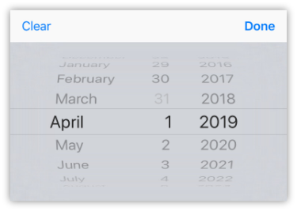

# Form Fields

## Using Form Fields

Before we go through the various fields available, let's take a look at how they look with their different embed options.

The first way to display one of these fields is just by itself without a container view.

```markup
<Rock:TextBox Label="Name" Placeholder="Your Name" />
```


Notice that there is no border or anything. It may not look like it, but that is a text box the user can tap on to bring up the keyboard. All the fields will behave this way, meaning not show any border or their own label. This is handled by the container views.

```markup
<Rock:FormField>
    <Rock:TextBox Label="Name" Placeholder="Your Name" />
</Rock:FormField>
```


The `<Rock:FormField>` view provides a way to show the label. It also handles showing a required indicator. This will be covered in more detail when reading up on that view itself.

```markup
<Rock:FormGroup Title="Name">
    <Rock:FormField>
        <Rock:TextBox Placeholder="Your Name" />
    </Rock:FormField>
</Rock:FormGroup>
```


Now we're talking. The `<Rock:FormGroup>` adds a border as well as some other sugar to your layout. Again, you can get all the details by reading up on the `FormGroup` view. However, note that in this sample we removed the `Label` from the `TextBox` and moved it to the `Title` property of the `FormGroup`. When displaying a single field this works well.

This will be the format the screenshots for each individual field will be shown in as it provides a good way to see the entire view and what it will look like.

## Rock Mobile Form Fields

### Address

_Inherits from_ [_FormFieldStack_](https://github.com/SparkDevNetwork/Rock.Mobile/wiki/Developer-Reference#FormFieldStack)

This view provides a field that allows the user to enter an address, or display an address to be updated. Because it has to account for international addresses very little validation is performed.

**Properties**

| Property | Type | Description |
| :--- | :--- | :--- |
| Label | string | _This value is not actually used since the view displays it's own label elements._ |
| IsRequired | bool | If set to **true** then the user will need to enter a value. |
| SelectedAddress | MobileAddress | Contains the address as entered by the user. Valid child properties are: Street1, City, State, PostalCode, Country. |

> Note: The `Addres` field is one of the few fields that should not be embedded in a `FormField`. It has a number of child `FormFields` to handle the different address parts. So if you try to embed it inside a `FormField` then you end up with double padding and double borders.

**Example**

```markup
<Rock:FormGroup Title="Rock Address">
    <Rock:Address IsRequired="false" />
</Rock:FormGroup>
```


If you need to provide a default address to be displayed when the view is rendered, you can do so as follows:

```markup
<Rock:FormGroup Title="Rock Address">
    <Rock:Address IsRequired="false">
        <Rock:Address.SelectedAddress>
            <Common:MobileAddress Street1="1885 Lost Ln"
                                  City="Knowhere"
                                  State="CA"
                                  PostalCode="92710"
                                  Country="USA" />
        </Rock:Address.SelectedAddress>
    </Rock:Address>
</Rock:FormGroup>
```

### Campus Picker

_Inherits from_ [_Picker_](https://github.com/SparkDevNetwork/Rock.Mobile/wiki/Developer-Reference#Picker)

The Campus Picker view is a picker that automatically populates with the campuses configured on the Rock server. The user can then select a campus from the list of items.

**Properties**

_See_ [_Picker_](https://github.com/SparkDevNetwork/Rock.Mobile/wiki/Developer-Reference#Picker) _for available properties._

**Example**

```markup
<Rock:FormGroup Title="Rock Campus Picker">
    <Rock:FormField>
        <Rock:CampusPicker IsRequired="false"
                               SelectedValue="76882AE3-1CE8-42A6-A2B6-8C0B29CF8CF8" />
    </Rock:FormField>
</Rock:FormGroup>
```


### CurrencyBox

_Inherits from_ [_NumberBox_](https://github.com/SparkDevNetwork/Rock.Mobile/wiki/Developer-Reference#NumberBox)

The Currency Box view provides an input box for the user to enter a currency amount. It ensures the value is a valid decimal amount during validation.

**Properties**

_See_ [_NumberBox_](https://github.com/SparkDevNetwork/Rock.Mobile/wiki/Developer-Reference#NumberBox) _for available properties._

**Example**

```markup
<Rock:FormGroup Title="Rock Currency Box">
    <Rock:FormField>
        <Rock:CurrencyBox IsRequired="false" Text="23.98" />
    </Rock:FormField>
</Rock:FormGroup>
```


### DatePicker

_Inherits from_ [_Xamarin.Forms.DatePicker_](https://docs.microsoft.com/en-us/dotnet/api/xamarin.forms.datepicker)

Presents a field that displays the selected date \(or placeholder text\) and allows the user to change the date. During edit mode, the date picker also exposes a Clear button that allows the user to clear the selected date completely.

**Properties**

| Property | Type | Description |
| :--- | :--- | :--- |
| Label | string | The label title to be used when wrapped in a control that displays a label for the field. |
| IsRequired | bool | If **True** then any validation performed will require that a date be selected. |
| Placeholder | string | The text to display in the field if no date is selected. |
| SelectedDate | DateTime? | The currently selected date or **null** if no date is selected. |

**Example**

```markup
<Rock:FormGroup Title="Rock Date Picker">
    <Rock:FormField>
        <Rock:DatePicker IsRequired="false" SelectedDate="7/4/2019" />
    </Rock:FormField>
</Rock:FormGroup>
```




### EmailBox

_Inherits from_ [_TextBox_](https://github.com/SparkDevNetwork/Rock.Mobile/wiki/Developer-Reference#TextBox)

The Email Box view provides an input box for the user to enter an e-mail address. It ensures the value is a somewhat valid address during validation. This does not sure it is a working e-mail address, only that it matches a basic syntax format.

**Properties**

_See_ [_TextBox_](https://github.com/SparkDevNetwork/Rock.Mobile/wiki/Developer-Reference#TextBox) _for available properties._

**Example**

```markup
<Rock:FormGroup Title="Rock Email Box">
    <Rock:FormField>
        <Rock:EmailBox IsRequired="false" Text="ted@rocksolidchurchdemo.com" />
    </Rock:FormField>
</Rock:FormGroup>
```


### Image

TBD

### MultiPicker

_Inherits from_ [_Xamarin.Forms.Label_](https://docs.microsoft.com/en-us/dotnet/api/xamarin.forms.label)

The multi picker will allow the user to make multiple selections from a list of available items. If the field is not marked as required then the user can also leave it empty. When the field is tapped then a new model screen is shown with the list of items and a toggle for each one.

**Properties**

| Property | Type | Description |
| :--- | :--- | :--- |
| Label | string | The label title to be used when wrapped in a control that displays a label for the field. |
| IsRequired | bool | If **True** then any validation performed will require that at least one value be selected. |
| Items | List | The items to be made available for user selection. _\(readonly\)_ |
| SelectedItems | IEnumerable&lt;PickerItem&gt; | The items that have been selected by the user. _\(readonly\)_ |
| SelectedValues | IList&lt;string&gt; | The item values that have been selected by the user. |
| SelectedValuesAsDelimited | string | The selected values as a comma delimited string. Useful with bindings to send the selected values back to the server. _\(readonly\)_ |

**Example**

```markup
<Rock:FormGroup Title="Rock Multi Picker">
    <Rock:FormField>
        <Rock:MultiPicker IsRequired="false"
                          SelectedValues="1,3,5">
            <Rock:PickerItem Value="1" Text="One" />
            <Rock:PickerItem Value="2" Text="Two" />
            <Rock:PickerItem Value="3" Text="Three" />
            <Rock:PickerItem Value="4" Text="Four" />
            <Rock:PickerItem Value="5" Text="Five" />
        </Rock:MultiPicker>
    </Rock:FormField>
</Rock:FormGroup>
```


As you can see in this example, the `SelectedValues` property can be used to _set_ the initial selection with a comma delimited string. There is some magic happening in XAML that allows that to work. But you try to bind to that property or read it's value then you get an array of strings back. That is why the `SelectedValuesAsDelimited` property exists, it automatically converts that array into a comma delimited string for you.

### NumberBox

_Inherits from_ [_TextBox_](https://github.com/SparkDevNetwork/Rock.Mobile/wiki/Developer-Reference#TextBox)

The Number Box view provides an input box for the user to enter a decimal number. It ensures the value is a valid decimal number during validation. The number may be negative and may or may not contain a fractional amount. However, if it does contain a decimal separator then it must also include atleast one digit after the separator.

**Properties**

_See_ [_TextBox_](https://github.com/SparkDevNetwork/Rock.Mobile/wiki/Developer-Reference#TextBox) _for available properties._

**Example**

```markup
<Rock:FormGroup Title="Rock Currency Box">
    <Rock:FormField>
        <Rock:NumberBox IsRequired="false" Text="-1325" />
    </Rock:FormField>
</Rock:FormGroup>
```


### PhoneNumberBox

_Inherits from_ [_Xamarin.Forms.ContentView_](https://docs.microsoft.com/en-us/dotnet/api/xamarin.forms.contentview)

The phone number box is actually a compound view composed of an optional Picker and a text box. The text box is for the actual phone number to be entered. If the Rock server is configured with more than one country code then the picker will become visible for the user to select the country code to use with the phone number.

If the entered country code and phone number match one of the formatting expressions in Rock then the phone number will be formatted according to those rules.

**Properties**

| Property | Type | Description |
| :--- | :--- | :--- |
| Label | string | The label title to be used when wrapped in a control that displays a label for the field. |
| IsRequired | bool | If **True** then any validation performed will require that a phone number be entered. |
| CountryCode | string | Contains the selected country code, even if the picker is not visible. |
| PhoneNumber | string | Contains the formatted phone number, not including the country code. |

**Example**

```markup
<Rock:FormGroup Title="Rock Phone Number Box">
    <Rock:FormField>
        <Rock:PhoneNumberBox IsRequired="false" CountryCode="1" PhoneNumber="(800) 555-1234" />
    </Rock:FormField>
</Rock:FormGroup>
```


The example above includes the country code so you can see what it looks like. Most Rock installations will probably have only one country code so that picker will not be visible.

### Picker

_Inherits from_ [_Xamarin.Forms.Picker_](https://docs.microsoft.com/en-us/dotnet/api/xamarin.forms.picker)

The picker will allow the user to select from a list of available items. If the field is not marked as required then the user can also leave it empty. When the field is tapped then a popup will appear allowing the user to select which item to choose.

**Properties**

| Property | Type | Description |
| :--- | :--- | :--- |
| Label | string | The label title to be used when wrapped in a control that displays a label for the field. |
| IsRequired | bool | If **True** then any validation performed will require that a value be selected. |
| Items | List | The items to be made available for user selection. _\(readonly\)_ |
| SelectedItem | PickerItem | The item that has been selected by the user. _\(readonly\)_ |
| SelectedValue | string | The item value that has been selected by the user. |
| SelectedValueAsInt | int? | The currently selected value cast to an integer, or `null` if there is no valid selection. _\(readonly\)_ |
| SelectedValueAsGuid | Guid? | The currently selected value cast to a Guid, or `null` if there is no valid selection. _\(readonly\)_ |

**Example**

```markup
<Rock:FormGroup Title="Rock Picker">
    <Rock:FormField>
        <Rock:Picker IsRequired="false" SelectedValue="2">
            <Rock:PickerItem Value="1" Text="One" />
            <Rock:PickerItem Value="2" Text="Two" />
            <Rock:PickerItem Value="3" Text="Three" />
            <Rock:PickerItem Value="4" Text="Four" />
            <Rock:PickerItem Value="5" Text="Five" />
        </Rock:Picker>
    </Rock:FormField>
</Rock:FormGroup>
```


### TextBox

_Inherits from_ [_Xamarin.Forms.Entry_](https://docs.microsoft.com/en-us/dotnet/api/xamarin.forms.entry)

Come on. Do we really need to explain what a text box is for? But seriously, as the name implies this view provides a place for the user to enter text on a page.

**Properties**

| Property | Type | Description |
| :--- | :--- | :--- |
| Label | string | The label title to be used when wrapped in a control that displays a label for the field. |
| IsRequired | bool | If **True** then any validation performed will require that some text be entered. |
| MaxLength | int | The maximum allowed length of the entered text, set to 0 for no limit. |
| ValidationExpression | string | A regular expression that will be used to validate the input. |
| ValidationExpressionMessage | string | The error message to display when input fails the ValidationExpression. |

**Example**

```markup
<Rock:FormGroup Title="Rock Text Box">
    <Rock:FormField>
        <Rock:TextBox IsRequired="false" Text="Rock Lobster!" />
    </Rock:FormField>
</Rock:FormGroup>
```


