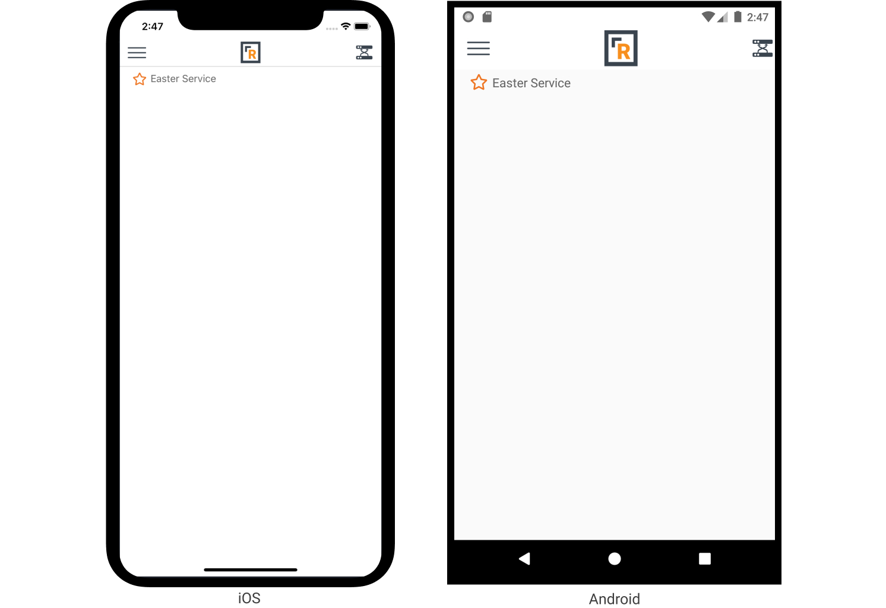

# Following Icon

_Inherits from_ [_Xamarin.Forms.Label_](https://docs.microsoft.com/en-us/dotnet/api/xamarin.forms.label)

Wouldn't it be nice if your mobile users could follow a content channel item and then later view a list of all their followed items? The `FollowingIcon` is what you are looking for. This view displays one of two icons, depending on the current state. That initial state is determined by the `IsFollowed`property. When the user taps on the icon, the state is toggled and an API call is made to the server to update the followed state of the entity.

This of course assumes that the user is currently logged in. If they are not logged in then no action will be taken. In the future we may add a new property to indicate an error message to the user that you can use to encourage your users to register or login to full functionality.

**Properties**

| Property | Type | Description |
| :--- | :--- | :--- |
| EntityId | int | The Id number of the entity to be followed. |
| EntityTypeId | int | The Id number of the entity's type. |
| IsFollowed | bool | The current followed state of the entity. _Defaults to **false**._ |
| FontSize | double | The size of the font to use. |
| FollowingIconClass | string | The icon class to display when the entity is being followed. _Defaults to **star**._ |
| FollowingIconFamily | [IconFamily](https://github.com/SparkDevNetwork/Rock.Mobile/wiki/Developer-Reference#IconFamily) | The icon family to use when the entity is not being followed. _Defaults to **FontAwesomeSolid**._ |
| FollowingIconColor | [Color](https://docs.microsoft.com/en-us/dotnet/api/xamarin.forms.color) | The color to use for the icon when the entity is being followed. |
| NotFollowingIconClass | string | The icon class to display when the entity is not being followed. _Defaults to **star**._ |
| NotFollowingIconFamily | [IconFamily](https://github.com/SparkDevNetwork/Rock.Mobile/wiki/Developer-Reference#IconFamily) | The icon family to use when the entity is not being followed. _Defaults to **FontAwesomeRegular**._ |
| NotFollowingIconColor | [Color](https://docs.microsoft.com/en-us/dotnet/api/xamarin.forms.color) | The color to use for the icon when the entity is not being followed. |
| NotLoggedInText | string | The message that is displayed to the user when they try to follow an item while not logged in. _Defaults to **You must be logged in to follow this item.**._ |

**Example**

The example below demonstrates how to display a group's name and a following icon to let the user follow that group. We are using the default icons. The first screenshot shows the not followed state and the second screenshot shows the followed state.

```text
<StackLayout Orientation="Horizontal">
    
    <Rock:FollowingIcon EntityTypeId="{{ group.TypeId }}"
                        EntityId="{{ group.Id }}"
                        FontSize="20"
                        IsFollowed="{{ group | IsFollowed }}"
                        FollowingIconColor="#ee7725"
                        NotFollowingIconColor="#ee7725" />
    <Label Text="{{ group.Name }}" />
</StackLayout>
```




