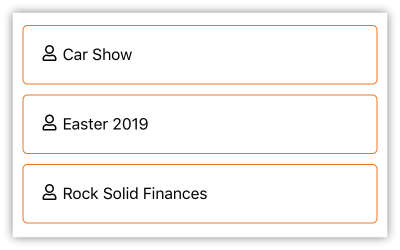

# Items View

## ItemsView

_Inherits from_ [_Xamarin.Forms.ContentView_](https://docs.microsoft.com/en-us/dotnet/api/xamarin.forms.contentview)

You have probably already thought that you could display a list of things with a Content block and some Lava entity commands and then just loop through them and render out the XAML to display each item. Sure you could do that, but that might not be the best route. The ItemsView allows you to use a template to design how you want each item displayed and also specify the layout \(list or grid\).

For example, you may just want a simple vertical list of rows with a small thumbnail image and the title. Or maybe you want a grid of just the thumbnails. Either is possible by changing some properties. This view copies a number of concepts from the [Xamarin.Forms.CollectionView](https://docs.microsoft.com/en-us/dotnet/api/xamarin.forms.collectionview) and you will find that they are, for the most part, interchangeable when it comes to their base functionality. They both layout a number of items on the page.

You will find the CollectionView to be more performant with larger lists as it uses native controls in the OS to perform the layout. But you will also find it more limited in some other functionality. For example, you cannot have a header that initially displays above the items and then scrolls away as you scroll through the list. ItemsView does allow you to do this.

**Properties**

| Property | Type | Description |
| :--- | :--- | :--- |
| ItemsSource | IEnumerable | The collection of items that will be used along with the ItemTemplate to render the content. |
| ItemTemplate | DataTemplate | The View structure template that will be used to build each individual item view. |
| ItemsLayout | ItemsLayout | Defines the type of layout to perform with the items. _Default is **ListItemsLayout** in **Vertical**orientation._ |
| IsScrollable | bool | If **true**, then a ScrollView will be used to wrap the content. This is required for dynamic loading, but also means the page must not have it's own ScrollView otherwise you will have issues. |
| HeaderView | View | The view structure to place above the first item. If IsScrollable is true then this view will scroll with the items. |
| FooterView | View | The view structure to place below the last item. If IsScrollable is true then this view will scroll with the items. |
| FixedHeaderView | View | The view structure to place above the items and HeaderView. This view will not scroll with the content. |
| FixedFooterView | View | The view structure to place below the items and FooterView. This view will not scroll with the content. |
| EmptyView | View | If ItemsSource is empty then this view will be displayed. |
| SelectedItem | object | The currently selected item from ItemsSource. |
| SelectionChangedCommand | ICommand | This command will be executed when an item is tapped on. This is accomplished by your ItemTemplate being wrapped in another View that has a tap handler installed on it. |
| SelectionChangedCommandParameter | object | The parameter to pass to the called command. |

In the following examples we are specifying an array of strings as the `ItemsSource`, this wouldn't be normal but it allows us to concisely provide an array of test items.

**Example**

```text
<Rock:ItemsView>
    <Rock:ItemsView.ItemsSource>
        <x:Array Type="{x:Type x:String}">
            <x:String>Car Show</x:String>
            <x:String>Easter 2019</x:String>
            <x:String>Rock Solid Finances</x:String>
        </x:Array>
    </Rock:ItemsView.ItemsSource>
    <Rock:ItemsView.ItemTemplate>
        <DataTemplate>
            <Frame BorderColor="#ee7725" HasShadow="false" Margin="0,0,0,10">
                <StackLayout Orientation="Horizontal">
                    <Rock:Icon IconClass="User" />
                    <Label Text="{Binding .}" />
                </StackLayout>
            </Frame>
        </DataTemplate>
    </Rock:ItemsView.ItemTemplate>
</Rock:ItemsView>
```



**Example**

```text
<Rock:ItemsView IsScrollable="true">
    <Rock:ItemsView.ItemsSource>
        <x:Array Type="{x:Type x:String}">
            <x:String>Car Show</x:String>
            <x:String>Easter 2019</x:String>
            <x:String>Rock Solid Finances</x:String>
        </x:Array>
    </Rock:ItemsView.ItemsSource>
    <Rock:ItemsView.ItemsLayout>
        <Rock:GridItemsLayout Orientation="Vertical" Span="2" HorizontalItemSpacing="10" VerticalItemSpacing="10" />
    </Rock:ItemsView.ItemsLayout>
    <Rock:ItemsView.FixedHeaderView>
        <ContentView BackgroundColor="#ee7725">
            <Label HorizontalTextAlignment="Center" Margin="15">Fixed Header</Label>
        </ContentView>
    </Rock:ItemsView.FixedHeaderView>
    <Rock:ItemsView.HeaderView>
        <ContentView BackgroundColor="#ae5715" Margin="0,0,0,10">
            <Label HorizontalTextAlignment="Center" Margin="15" TextColor="White">Header</Label>
        </ContentView>
    </Rock:ItemsView.HeaderView>
    <Rock:ItemsView.ItemTemplate>
        <DataTemplate>
            <Frame BorderColor="#ee7725" HasShadow="false">
                <StackLayout Orientation="Horizontal">
                    <Rock:Icon IconClass="User" />
                    <Label Text="{Binding .}" />
                </StackLayout>
            </Frame>
        </DataTemplate>
    </Rock:ItemsView.ItemTemplate>
    <Rock:ItemsView.FooterView>
        <ContentView BackgroundColor="#ae5715" Margin="0,10,0,0">
            <Label HorizontalTextAlignment="Center" Margin="15" TextColor="White">Footer</Label>
        </ContentView>
    </Rock:ItemsView.FooterView>
    <Rock:ItemsView.FixedFooterView>
        <ContentView BackgroundColor="#ee7725">
            <Label HorizontalTextAlignment="Center" Margin="15">Fixed Footer</Label>
        </ContentView>
    </Rock:ItemsView.FixedFooterView>
</Rock:ItemsView>
```


If we had enough items to fill the screen in this second example, you would see that initially only the **Fixed Header**, **Header**, a number of items and the **Fixed Footer** would be visible. The **Footer** would be off-screen because it would be inside the scroll view. If you were to scroll that long list of items up you would push the **Header** off screen and eventually the **Footer** would appear. Both the **Fixed Header** and **Fixed Footer** would always stay visible.

