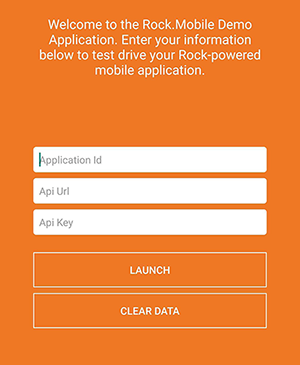
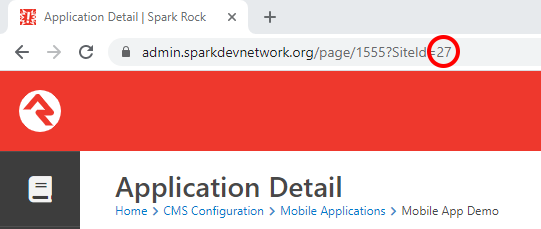
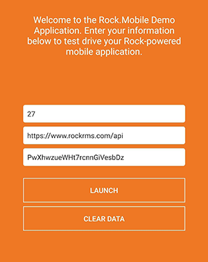

# Accessing Your App

When you first install and launch the Rock Mobile demo app, you'll be greeted with a screen like this:

All of this information can be found by navigating to the application's internal page, under Home &gt; CMS Configuration &gt; Mobile Applications. Let's take a look at each of them.

### Application Id

This is the ID given to the application by Rock when it is created. It cannot be changed. To find your application ID, navigate to the app's internal page and check the number in the URL bar.

### Api Url

This is simply the URL to your Rock server's API. For example: [https://www.rockrms.com/api](https://www.rockrms.com/api)

### Api Key

Think of this as the app's password. It will start out as something auto-generated, and we highly recommend that it gets changed to something short and easy for everyone to remember. It is not case-sensitive. 

When finished, your form will look something like this:

