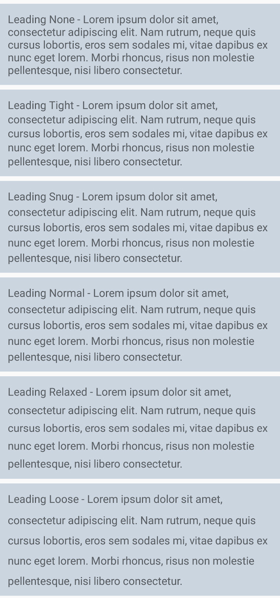

# Text

## Weights & Styles

The following two weights are available as utility classes.

### Bold

Use the `.text-bold` utility class to bold text.

```text
<Label StyleClass="text-bold" Text="Lots of trouble. Lots of bubble." />
```

### Underline

Use the `.text-underline` utility class to underline text.

```text
<Label StyleClass="text-underline" Text="Lots of trouble. Lots of bubble." />
```

## Text Sizes

Several utility classes have been created to help you size your text. Apple and Google both have styling standards for various types of text in your application. We've provided a set of classes for their UI patterns as well as a general set if you prefer to go your own way.

### Named Sizes

The following classes allow you to size your text the way that Apple and Google intended.

| Class | iOS | Android |
| :--- | :--- | :--- |
| .text-default | 16 | 14 |
| .text-micro | 11 | 10 |
| text-small | 13 | 14 |
| .text-medium | 16 | 17 |
| .text-large | 20 | 22 |
| .text-body | 17 | 16 |
| .text-header | 17 | 16 |
| .text-title | 28 | 24 |
| .text-subtitle | 22 | 16 |
| .text-caption | 12 | 12 |

### Utility Sizes

If you'd prefer to have additional options to size your text, we've provided the following classes to help.

| Class | Size |
| :--- | :--- |
| .text-xs | 10.5 |
| .text-sm | 22.25 |
| .text-base | 14 |
| .text-lg | 15.75 |
| .text-xl | 17.5 |
| .text-2xl | 21 |
| .text-3xl | 26.25 |
| .text-4xl | 31.5 |
| .text-5xl | 42 |
| .text-6xl | 56 |

The sizes above are based off of a default starting point \(14 which determines `.text-base`\). The rest of the sizes are built off of those using ratios.

### Heading Sizes

Not to add yet another sizing pattern, but we've added utility classes for headings. These are helpful when using content that is being converted from HTML or Markdown. You can easily override these sizes in your own CSS.

| Class | Property |
| :--- | :--- |
| .heading1 | 27 |
| .heading2 | 20 |
| .heading3 | 18 |
| .heading4 | 16 |
| .heading5 | 14 |
| .heading6 | 14 |

## Decoration

Mobile applications have limited ability to decorate text, therefore, we only have a few options for styling.

### Underline

Use the `.text-underline` utility class to underline text.

```text
<Label StyleClass="text-underline" Text="Lots of trouble. Lots of bubble." />
```

### Strikethrough

Use the `.text-strikethrough` utility class to place a line through your text.

```text
<Label StyleClass="text-strikethrough" Text="Lots of trouble. Lots of bubble." />
```

## Line Height

Leading is the amount of space between the lines of a paragraph. Below are utility classes that allow you to select the right amount for your application.

| Class | Properties |
| :--- | :--- |
| .leading-none | line-height: 1; |
| .leading-tight | line-height: 1.1; |
| .leading-snug | line-height: 1.2; |
| .leading-normal | line-height: 1.25; |
| .leading-relaxed | line-height: 1.4; |
| .leading-loose | line-height: 1.6; |



