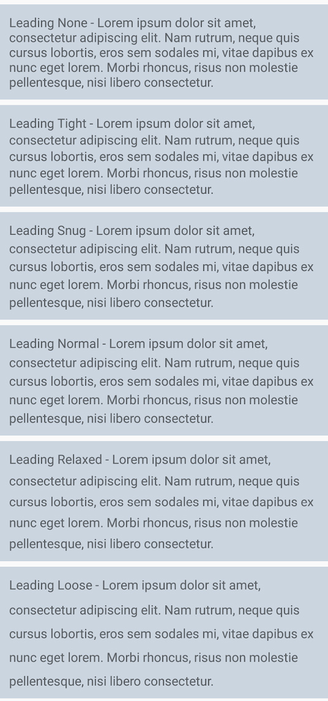

# Line Height

Leading is the amount of space between the lines of a paragraph. Below are utility classes that allow you to select the right amount for your application.

| Class | Properties |
| :--- | :--- |
| .leading-none | line-height: 1; |
| .leading-tight | line-height: 1.1; |
| .leading-snug | line-height: 1.2; |
| .leading-normal | line-height: 1.25; |
| .leading-relaxed | line-height: 1.4; |
| .leading-loose | line-height: 1.6; |

