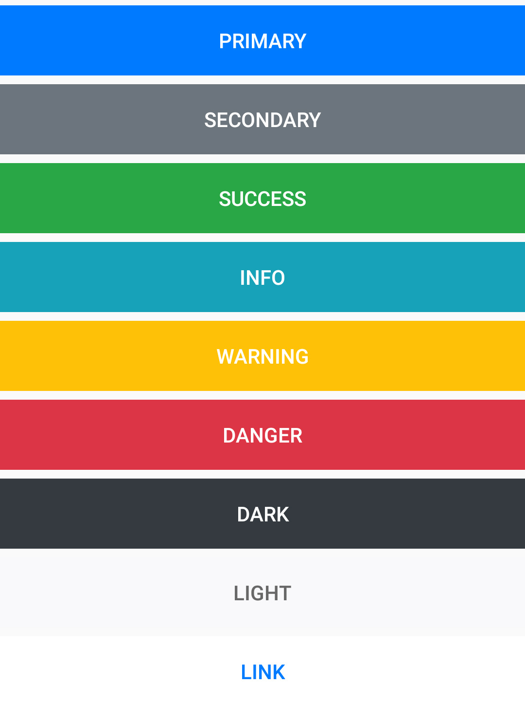
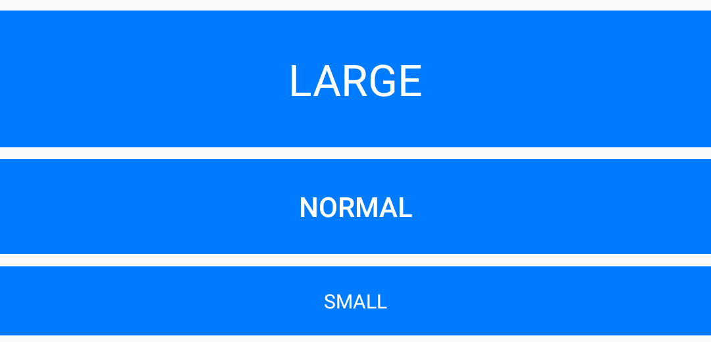

# Buttons

## Default Buttons

The following utility classes have been created for use with buttons. You'll find this works very similar to that of Bootstrap.



```text
<Button Text="Primary" StyleClass="btn,btn-primary" />
<Button Text="Success" StyleClass="btn,btn-success" />
<Button Text="Info" StyleClass="btn,btn-info" />
<Button Text="Warning" StyleClass="btn,btn-warning" />
<Button Text="Danger" StyleClass="btn,btn-danger" />
<Button Text="Dark" StyleClass="btn,btn-dark" />
<Button Text="Light" StyleClass="btn,btn-light" />
<Button Text="Link" StyleClass="btn,btn-link" />
```

Outline Buttons

You can create outline buttons with the following markup.


```text
<Button Text="Primary" StyleClass="btn,btn-outline-primary" />
<Button Text="Success" StyleClass="btn,btn-outline-success" />
<Button Text="Info" StyleClass="btn,btn-outline-info" />
<Button Text="Warning" StyleClass="btn,btn-outline-warning" />
<Button Text="Danger" StyleClass="btn,btn-outline-danger" />
<Button Text="Dark" StyleClass="btn,btn-outline-dark" />
<Button Text="Light" StyleClass="btn,btn-outline-light" />

```

## Button Sizes

You can also control the sizes of your buttons with these classes.



```text
<Button Text="Primary" StyleClass="btn,btn-primary,btn-lg" />
<Button Text="Success" StyleClass="btn,btn-primary" />
<Button Text="Info" StyleClass="btn,btn-primary,btn-sm" />
```

