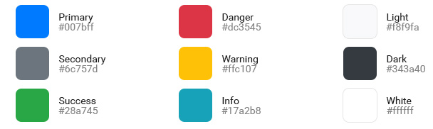

# Colors

We've provided two sets of colors for you to use. The first, Application Colors, are the specific colors that you'll define specifically for your application. The names should look familiar to you as they are pulled from the [Bootstrap ](https://getbootstrap.com/)framework. The second set of colors provide a standard and well designed palette for you to use within your application. This palette comes from the [Tailwind ](https://tailwindcss.com)framework.

## Interface Colors

There are several interface colors that can be set through the mobile application settings. The follow CSS notation can be used to access these colors in your application's stylesheets.

* `?color-background` - the background color for the application.
* `?color-heading` - the text color for headings.
* `?color-text` - the general text color.

## Application Colors

The following colors are available for you to use and customize for your application. You can access these colors in your CSS using the notation `?color-colorname` \(e.g. `?color-primary`\).




Application colors can be used with XAML properties of type `Color` using the following syntax.

```text
<Rock:Tag Text="Custom Pallette Color" 
        BackgroundColor="{Rock:PaletteColor pink-800}"
        TextColor="{Rock:PaletteColor App-Primary}" />
```

## Palette Colors

Creating sets of well matched colors can be difficult. We've incorporated the well-balanced colors of the [Tailwind CSS framework](https://tailwindcss.com/docs/customizing-colors) so you'll have easy access to a great set of colors for your application.

When using these colors you'll reference the color name and the saturation value. For example to use the 600 weight of gray for text you'd use `.text-gray-600`. To use the same gray as a background you'd reference `.bg-gray-600`.

You can access these colors in your CSS using the notation `?color-colorname-intensity` \(e.g. `?color-gray-400`\).

Palette colors can be used with XAML properties of type `Color` using the following syntax.

```text
<Rock:Tag Text="Custom Pallette Color" 
        BackgroundColor="{Rock:PaletteColor pink-800}"
        TextColor="{Rock:PaletteColor pink-200}" />
```

### Gray


### Red


### Orange


### Yellow


### Green


### Teal


### Blue


### Indigo


### Purple


### Pink


