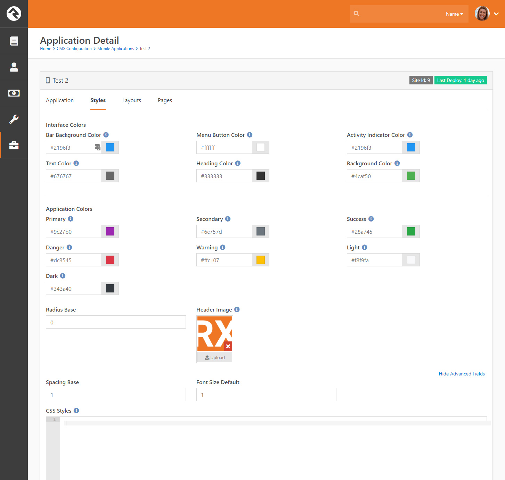

# Custom CSS

You can add your own custom CSS to your application in the `Styles` tab of the application settings under the `Advanced Options` section.



Here you can add custom classes, target specific views, etc. There are several custom variables you can use in your CSS to represent colors and settings. These variables are listed below.

## Custom Utility Classes

Rock Mobile provides a set of utility class selectors to help target your styling to specific platforms, device types,  pages and blocks. Each is discussed below.

### Targeting Platforms

If you need to target styling to a specific platform \(iOS or Android\) you can use the parent classes `.ios` or `.android`.

```text
.ios .heading1 {
    font-size: 33; 
}
```

### Targeting Device Types

Similar to platforms you can also target device types with `.phone` or `.tablet`.

```text
.phone .heading1 {
    font-size: 33;
}
```

### Combining Platform and and Device Types

Need to get real specific? You can combine the two class as shown below. In general you should try to make your design work without too many of these specific styles.

```text
.ios.phone .heading1 {
    color: red;
}
```

### Styling Pages

When configuring a page you can provide a CSS class you would like to add to the page. This will allow you to scope the styling of elements on that page.

```text
.page-aboutus .heading1 {
    font-size: 33;
}
```

### Styling Blocks

Each Rock mobile block has a CSS class assigned to it. This allows you to target the visual elements within a specific block. The pattern to use is `.block-[block type name lowercase]`. For example, the calendar block would be `.block-calendarview`.

```text
.block-calendarview .heading1 {
    font-size: 33;
}
```

### Combining it All

The example below is not a best practice, but shows you how you can use all of the utility classes together if needed. If you find yourself writing these types of CSS rules your trying to swim up-stream should consider a better styling strategy.

```text
.ios.phone.page-aboutus .block-content .heading1 {
    font-size: 33;
}
```

## Color Variables

Downhill includes several color variables that you can use in your CSS to reference colors defined in the administrative settings as well as a curated palette of colors that will bring consistency to your application.

### Application Colors

| Variable | Value |
| :--- | :--- |
| ?color-primary | The primary color that is selected in the `Style` settings. |
| ?color-secondary | The secondary color that is selected in the `Style` settings. |
| ?color-success | The success color that is selected in the `Style` settings. |
| ?color-danger | The danger color that is selected in the `Style` settings. |
| ?color-warning | The warning color that is selected in the `Style` settings. |
| ?color-light | The light color that is selected in the `Style` settings. |
| ?color-dark | The dark color that is selected in the `Style` settings. |

### Palette Colors

[Palette colors](text/color.md#palette-colors) can be referenced with the following notation.

`?color-{color}-{intensity}`

Example  
`?color-orange-400`

## Alert Colors

Alert boxes are made up of three different colors:

* Background Color
* Text Color
* Border Color

These three colors are generated based of the Bootstrap alert recipe from the application colors above. The patterns for usage are:

`?color-{application-color}-{property}`

Example

`?color-primary-background`  
`?color-primary-border`  
`?color-primary-text`

## Misc Variables

Below are some additional variables you can reference:

| Variable | Value |
| :--- | :--- |
| ?radius-base | The base radius that is configured. |
| ?spacing-base | The default value to use for margins and padding. |
| ?font-size-default | The default font size. |
| ?color-text | The default color for text. |
| ?color-heading | The default color for use with headings. |
| ?color-background | The default background color. |

