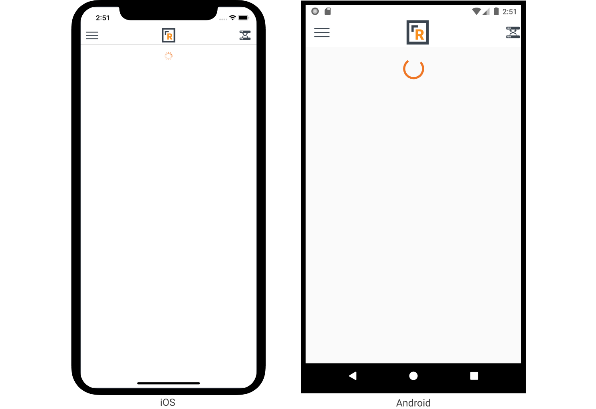
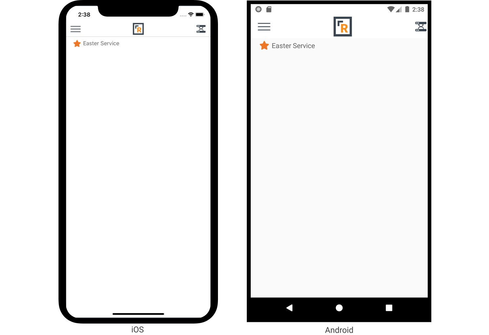
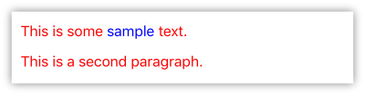

# Views

## Xamarin Forms Base Views

Xamarin Forms provides a rich collection of base views \(controls\). You can find a documentation on these views on the [Xamarin Forms Documentation site](https://docs.microsoft.com/en-us/xamarin/xamarin-forms/user-interface/controls/views).

## Rock Mobile Custom Controls

In addition to all the [Xamarin Views](https://docs.microsoft.com/en-us/xamarin/xamarin-forms/user-interface/controls/views) you have available, there are a number of Rock specific views that you can use to customize your user's experience.

### ActivityIndicator

_Inherits from_ [_Xamarin.Forms.ContentView_](https://docs.microsoft.com/en-us/dotnet/api/xamarin.forms.contentview)

Sometimes things take a moment to load. You don't want to just display a big white screen for the user to stare at, you want them to know we're working hard for them. That said, usually you are not going to be instantiating this view directly. But just in case you want to, here you go.

The ActivityIndicator will begin "working" when it becomes visible on screen. Initially, it will not show anything. Once a built-in timer elapses \(350ms\) then the actual indicator becomes visible. Your user will not care if it takes your page a few hundred milliseconds to load so there is no need to show them a spinning wheel right away.

**Properties**

| Property | Type | Description |
| :--- | :--- | :--- |
| IsVisible | bool | If `true` then the activity indicator will be visible and show that work is being done. |

**Example**

```text
<Rock:ActivityIndicator />
```



### FollowingIcon

_Inherits from_ [_Xamarin.Forms.Label_](https://docs.microsoft.com/en-us/dotnet/api/xamarin.forms.label)

Wouldn't it be nice if your mobile users could follow a content channel item and then later view a list of all their followed items? The `FollowingIcon` is what you are looking for. This view displays one of two icons, depending on the current state. That initial state is determined by the `IsFollowed`property. When the user taps on the icon, the state is toggled and an API call is made to the server to update the followed state of the entity.

This of course assumes that the user is currently logged in. If they are not logged in then no action will be taken. In the future we may add a new property to indicate an error message to the user that you can use to encourage your users to register or login to full functionality.

**Properties**

| Property | Type | Description |
| :--- | :--- | :--- |
| EntityId | int | The Id number of the entity to be followed. |
| EntityTypeId | int | The Id number of the entity's type. |
| IsFollowed | bool | The current followed state of the entity. _Defaults to **false**._ |
| FontSize | double | The size of the font to use. |
| FollowingIconClass | string | The icon class to display when the entity is being followed. _Defaults to **star**._ |
| FollowingIconFamily | [IconFamily](https://github.com/SparkDevNetwork/Rock.Mobile/wiki/Developer-Reference#IconFamily) | The icon family to use when the entity is not being followed. _Defaults to **FontAwesomeSolid**._ |
| FollowingIconColor | [Color](https://docs.microsoft.com/en-us/dotnet/api/xamarin.forms.color) | The color to use for the icon when the entity is being followed. |
| NotFollowingIconClass | string | The icon class to display when the entity is not being followed. _Defaults to **star**._ |
| NotFollowingIconFamily | [IconFamily](https://github.com/SparkDevNetwork/Rock.Mobile/wiki/Developer-Reference#IconFamily) | The icon family to use when the entity is not being followed. _Defaults to **FontAwesomeRegular**._ |
| NotFollowingIconColor | [Color](https://docs.microsoft.com/en-us/dotnet/api/xamarin.forms.color) | The color to use for the icon when the entity is not being followed. |
| NotLoggedInText | string | The message that is displayed to the user when they try to follow an item while not logged in. _Defaults to **You must be logged in to follow this item.**._ |

**Example**

The example below demonstrates how to display a group's name and a following icon to let the user follow that group. We are using the default icons. The first screenshot shows the not followed state and the second screenshot shows the followed state.

```text
<StackLayout Orientation="Horizontal">
    
    <Rock:FollowingIcon EntityTypeId="{{ group.TypeId }}"
                        EntityId="{{ group.Id }}"
                        FontSize="20"
                        IsFollowed="{{ group | IsFollowed }}"
                        FollowingIconColor="#ee7725"
                        NotFollowingIconColor="#ee7725" />
    <Label Text="{{ group.Name }}" />
</StackLayout>
```




### FormFieldStack

_Inherits from_ [_Xamarin.Forms.Layout_](https://docs.microsoft.com/en-us/dotnet/api/xamarin.forms.layout-1)

This view is not currently intended to be used directly. There is nothing preventing you from using it, but your mileage may vary. The FormFieldStack is used internally by the [FormGroup](https://github.com/SparkDevNetwork/Rock.Mobile/wiki/Developer-Reference#FormGroup) to display multiple fields in a vertical layout.

When displaying a [FormField](https://github.com/SparkDevNetwork/Rock.Mobile/wiki/Developer-Reference#FormField) this view is responsible for drawing the border around the group of fields as well as the lines between the fields.

**Properties**

| Property | Type | Description |
| :--- | :--- | :--- |
| BorderColor | [Color](https://docs.microsoft.com/en-us/dotnet/api/xamarin.forms.color) | The color to be used for the border as well as the inter-field lines. |
| BorderSize | double | The width, in pixels, to be used when drawing the borders. _Default value is 1._ |

**Example**

```text
<Rock:FormFieldStack>
    <Rock:FormField>
        <Rock:TextBox Label="Username" />
    </Rock:FormField>
    <Rock:FormField>
        <Rock:TextBox Label="Password" />
    </Rock:FormField>
</Rock:FormFieldStack>
```


### Html

_Inherits from_ [_Xamarin.Forms.ContentView_](https://docs.microsoft.com/en-us/dotnet/api/xamarin.forms.contentview)

This view allows you to render HTML into the page. HTML rendering is limited on mobile applications and not as performant as it could be. Therefore it is recommended you limit your HTML usage. You don't need to avoid it, just try not to render a few dozen paragraphs of text and expect it to be snappy.

A limited subset of HTML tags is supported. Any non-supported tags will be rendered as their plain text contents \(meaning, the HTML tags are stripped\).

* `H1` - `H6`
* `DIV`
* `P`
* `SPAN`
* `STRONG`
* `B`
* `EM`
* `I`
* `CODE`
* `PRE`
* `OL`
* `UL`
* `LI`

In addition, in-line styles are supported, but again only a few styles are supported:

* `color`
* `background-color`

It should be noted that because you are defining your HTML content in an XML file you cannot simply do something like `Text="{{ Item.Html }}"` and expect it to work. You will need to escape the HTML text, or you can use the `CDATA` trick as shown in the example.

**Properties**

| Property | Type | Description |
| :--- | :--- | :--- |
| Text | string | The text content that contains the HTML. |
| Lava | bool | If **true** then the Text will be processed for any Lava before final rendering happens. _Defaults to **false**._ |
| FontFamily | string | The font family to use by default. |
| FontSize | double | The size of the font to use by default. |
| TextColor | [Color](https://docs.microsoft.com/en-us/dotnet/api/xamarin.forms.color) | The color of the text to use by default. _Default value is **Black**._ |

**Example**

```text
<Rock:Html TextColor="Red">
    <![CDATA[
    <p>This is some <span style='color: blue'>sample</span> text.</p>
    <p>This is a second paragraph.</p>
    ]]>
</Rock:Html>
```



### Icon

_Inherits from_ [_Xamarin.Forms.Label_](https://docs.microsoft.com/en-us/dotnet/api/xamarin.forms.label)

We are all accustomed to displaying nice icons on our pages. Your mobile application should be no different. This view allows you to display an icon from the FontAwesome library on your page.

Unlike on the web, you must specify the icon family that you wish to display from. So for example, you cannot just set `IconClass="car"` and have it work, because the Car icon is not availabe in the Regular font \(which is the default icon font family\). So you would need to display with `IconClass="car" IconFamily="Solid"`.

**Properties**

| Property | Type | Description |
| :--- | :--- | :--- |
| IconClass | string | The icon class name to use. This can be found on the FontAwesome website. If it specified `fas fa-car` then you would use `car`. |
| IconFamily | [IconFamily](https://github.com/SparkDevNetwork/Rock.Mobile/wiki/Developer-Reference#IconFamily) | The icon font family to use to display the icon. _Default value is **FontAwesomeRegular**._ |
| FontSize | double | The size of the icon. |
| TextColor | [Color](https://docs.microsoft.com/en-us/dotnet/api/xamarin.forms.color) | The color of the icon to use by default. |
| Command | ICommand | The command to be executed when the user taps on the icon. |
| CommandParameter | object | The object to be passed as the parameter to `Command`. |

**Example**

```text
<StackLayout Orientation="Horizontal">
    <Rock:Icon IconClass="car" IconFamily="FontAwesomeSolid" FontSize="32" />
    <Rock:Icon IconClass="rockrms" IconFamily="FontAwesomeBrands" TextColor="#ee7725" FontSize="32" />
    <Rock:Icon IconClass="user" FontSize="32" />
</StackLayout>
```


### Image

_Inherits from_ [_Xamarin.Forms.ContentView_](https://docs.microsoft.com/en-us/dotnet/api/xamarin.forms.contentview)

One of the most common controls you'll want to use is the image control. Because of it's importance effort has been invested into ensuring that it has a all the power you need. Let's start with the basics.

```text
<Rock:Image Source="https://server.com/photo.jpg" /> 
```

Is that it? No, we're just getting started. Below are all of the properties you can add to images.

<table>
  <thead>
    <tr>
      <th style="text-align:left">Property</th>
      <th style="text-align:left">Type</th>
      <th style="text-align:left">Description</th>
    </tr>
  </thead>
  <tbody>
    <tr>
      <td style="text-align:left">BackgroudColor</td>
      <td style="text-align:left">Color</td>
      <td style="text-align:left">The color to use for the background. This is useful if you&apos;d like
        to show a placeholder color while the image downloads.</td>
    </tr>
    <tr>
      <td style="text-align:left">HeightRequest</td>
      <td style="text-align:left">int</td>
      <td style="text-align:left">The height you&apos;d like your image to be.</td>
    </tr>
    <tr>
      <td style="text-align:left">WidthRequest</td>
      <td style="text-align:left">int</td>
      <td style="text-align:left">The width you&apos;d like your image to be.</td>
    </tr>
    <tr>
      <td style="text-align:left">Aspect</td>
      <td style="text-align:left"></td>
      <td style="text-align:left"></td>
    </tr>
    <tr>
      <td style="text-align:left">HorizontalOptions</td>
      <td style="text-align:left">LayoutOption</td>
      <td style="text-align:left">
        <p>This describes how the element is laid out horizontally within the parent
          , and how this element should consume leftover space on the X axis. Common
          values would be:</p>
        <p>Center - centered and does not expand.</p>
        <p>FillAndExpand - Fills the whole area.</p>
      </td>
    </tr>
    <tr>
      <td style="text-align:left">VerticalOptions</td>
      <td style="text-align:left">LayoutOption</td>
      <td style="text-align:left">This describes how the element is laid out vertically within the parent
        , and how this element should consume leftover space on the Y axis.</td>
    </tr>
    <tr>
      <td style="text-align:left">Margin</td>
      <td style="text-align:left">Thickness</td>
      <td style="text-align:left">Images, like most controls can have margins. This is typically note as <code>Margin=&quot;Left,Top,Right,Bottom&quot;</code>.</td>
    </tr>
  </tbody>
</table>Done now? Nope still have much more to consider.

#### Image Transformations

You can apply several different transformations on your images. Each is discussed below.

**Blur**

You can easily add a blur to your image with this simple transformation.

```text
<Rock:Image Source="https://server.com/photo.jpg" >
    <Rock:BlurTransformation Radius="4" />
</Rock:Image>
```

| **Property** | Type | Description |
| :--- | :--- | :--- |
| Radius | Float | The amount of blur to add. |

**Circle**

The circle transformation masks your images into a circle shape. The syntax for this is below.

```text
<Rock:Image 
    Source="https://server.com/photo.jpg" 
    BackgroundColor="#c4c4c4"
    HeightRequest="128"
    WidthRequest="128"
    Aspect="AspectFill" 
    HorizontalOptions="Center" 
    VerticalOptions="Fill">
        <Rock:CircleTransformation 
            BorderSize="4" 
            BorderColor="rgba(255, 255, 255, 0.58)" />
</Rock:Image>
```

| Property | Type | Description |
| :--- | :--- | :--- |
| BorderSize | int | The size of the optional border around the image. |
| BorderColor | Color | The color of the border around the image. |

**Drop Shadow**

The filter adds a customizable drop shadow to your images.

```text
<Rock:Image 
    Source="https://server.com/photo.jpg" 
    BackgroundColor="#c4c4c4"
    HeightRequest="300"
    WidthRequest="300"
    Aspect="AspectFill" 
    HorizontalOptions="Center" 
    VerticalOptions="Fill">
        <Rock:DropShadowTransformation 
            Distance="8"
            Angle="135"
            Radius="4"
            Color="#c4c4c4" />
</Rock:Image>
```

| Property | Type | Description |
| :--- | :--- | :--- |
| Distance | double | Determines how far the drop shadow should extend below the image. |
| Angle | double | Sets the direction the drop shadow should extend from. |
| Radius | double | Determines the level of blur the drop shadow should use. |
| Color | Color | The color of the drop shadow. |

**Fill Color**

This adds a fill color effect to your image. 

```text
<Rock:Image Source="https://server.com/photo.jpg" >
    <Rock:FillColorTransformation Color="#41BFD0" />
</Rock:Image>
```

| Property | Type | Description |
| :--- | :--- | :--- |
| Color | Color | The color to fill the image with. |

**Flip** 

Flips the image either horizontally, vertically or both.

```text
<Rock:Image Source="https://server.com/photo.jpg" >
    <Rock:FlipTransformation Direction="Both" />
</Rock:Image>
```

| Property | Type | Description |
| :--- | :--- | :--- |
| Direction | FlipDirection | Valid values include: Horizontal, Vertical or Both |

**Gray Scale**

Converts the image to gray scale.

```text
<Rock:Image Source="https://server.com/photo.jpg" >
    <Rock:GrayscaleTransformation Saturation="0" />
</Rock:Image>
```

| Property | Type | Description |
| :--- | :--- | :--- |
| Saturation | double | Determines this level of color saturation. A value of `1.0` will not change the original image. Using `0.0` will make the image fully grayscale. You can also provide `-1.0` to invert the image. |

**Reflection**

Draws a reflection of the image as if the image were sitting on a glass surface.

```text
<Rock:Image Source="https://server.com/photo.jpg" >
    <Rock:ReflectionTransformation Size="32" />
</Rock:Image>
```

| Property | Type | Description |
| :--- | :--- | :--- |
| Size | double | The size of the reflection. |

**Rounded**

Rounds the corners of the image and optionally adds a border.

```text
<Rock:Image Source="https://server.com/photo.jpg" >
    <Rock:RoundedTransformation 
        CornerRadius="8, 20, 0, 2" 
        BorderSize="4" 
        BorderColor="rgba(255, 255, 255, 0.58)" />
</Rock:Image>
```

| Property | Type | Description |
| :--- | :--- | :--- |
| CorderRadius | CornerRadius | You can provide a specific radius for each corner, or provide one value to be used for all of them. |
| BorderSize | float | The size of the border to optionally apply. |
| BorderColor | Color | The color of the border to apply. |

**Tint**

Tints the image using the provided color.

```text
<Rock:Image Source="https://server.com/photo.jpg" >
    <Rock:TintTransformation Color="#41BFD0" />
</Rock:Image>
```

| Property | Type | Description |
| :--- | :--- | :--- |
| Color | Color | The color to use to tint the mid-tones of the image. |


### ItemsView

_Inherits from_ [_Xamarin.Forms.ContentView_](https://docs.microsoft.com/en-us/dotnet/api/xamarin.forms.contentview)

You have probably already thought that you could display a list of things with a Content block and some Lava entity commands and then just loop through them and render out the XAML to display each item. Sure you could do that, but that might not be the best route. The ItemsView allows you to use a template to design how you want each item displayed and also specify the layout \(list or grid\).

For example, you may just want a simple vertical list of rows with a small thumbnail image and the title. Or maybe you want a grid of just the thumbnails. Either is possible by changing some properties. This view copies a number of concepts from the [Xamarin.Forms.CollectionView](https://docs.microsoft.com/en-us/dotnet/api/xamarin.forms.collectionview) and you will find that they are, for the most part, interchangeable when it comes to their base functionality. They both layout a number of items on the page.

You will find the CollectionView to be more performant with larger lists as it uses native controls in the OS to perform the layout. But you will also find it more limited in some other functionality. For example, you cannot have a header that initially displays above the items and then scrolls away as you scroll through the list. ItemsView does allow you to do this.

**Properties**

| Property | Type | Description |
| :--- | :--- | :--- |
| ItemsSource | IEnumerable | The collection of items that will be used along with the ItemTemplate to render the content. |
| ItemTemplate | DataTemplate | The View structure template that will be used to build each individual item view. |
| ItemsLayout | ItemsLayout | Defines the type of layout to perform with the items. _Default is **ListItemsLayout** in **Vertical**orientation._ |
| IsScrollable | bool | If **true**, then a ScrollView will be used to wrap the content. This is required for dynamic loading, but also means the page must not have it's own ScrollView otherwise you will have issues. |
| HeaderView | View | The view structure to place above the first item. If IsScrollable is true then this view will scroll with the items. |
| FooterView | View | The view structure to place below the last item. If IsScrollable is true then this view will scroll with the items. |
| FixedHeaderView | View | The view structure to place above the items and HeaderView. This view will not scroll with the content. |
| FixedFooterView | View | The view structure to place below the items and FooterView. This view will not scroll with the content. |
| EmptyView | View | If ItemsSource is empty then this view will be displayed. |
| SelectedItem | object | The currently selected item from ItemsSource. |
| SelectionChangedCommand | ICommand | This command will be executed when an item is tapped on. This is accomplished by your ItemTemplate being wrapped in another View that has a tap handler installed on it. |
| SelectionChangedCommandParameter | object | The parameter to pass to the called command. |

In the following examples we are specifying an array of strings as the `ItemsSource`, this wouldn't be normal but it allows us to concisely provide an array of test items.

**Example**

```text
<Rock:ItemsView>
    <Rock:ItemsView.ItemsSource>
        <x:Array Type="{x:Type x:String}">
            <x:String>Car Show</x:String>
            <x:String>Easter 2019</x:String>
            <x:String>Rock Solid Finances</x:String>
        </x:Array>
    </Rock:ItemsView.ItemsSource>
    <Rock:ItemsView.ItemTemplate>
        <DataTemplate>
            <Frame BorderColor="#ee7725" HasShadow="false" Margin="0,0,0,10">
                <StackLayout Orientation="Horizontal">
                    <Rock:Icon IconClass="User" />
                    <Label Text="{Binding .}" />
                </StackLayout>
            </Frame>
        </DataTemplate>
    </Rock:ItemsView.ItemTemplate>
</Rock:ItemsView>
```


**Example**

```text
<Rock:ItemsView IsScrollable="true">
    <Rock:ItemsView.ItemsSource>
        <x:Array Type="{x:Type x:String}">
            <x:String>Car Show</x:String>
            <x:String>Easter 2019</x:String>
            <x:String>Rock Solid Finances</x:String>
        </x:Array>
    </Rock:ItemsView.ItemsSource>
    <Rock:ItemsView.ItemsLayout>
        <Rock:GridItemsLayout Orientation="Vertical" Span="2" HorizontalItemSpacing="10" VerticalItemSpacing="10" />
    </Rock:ItemsView.ItemsLayout>
    <Rock:ItemsView.FixedHeaderView>
        <ContentView BackgroundColor="#ee7725">
            <Label HorizontalTextAlignment="Center" Margin="15">Fixed Header</Label>
        </ContentView>
    </Rock:ItemsView.FixedHeaderView>
    <Rock:ItemsView.HeaderView>
        <ContentView BackgroundColor="#ae5715" Margin="0,0,0,10">
            <Label HorizontalTextAlignment="Center" Margin="15" TextColor="White">Header</Label>
        </ContentView>
    </Rock:ItemsView.HeaderView>
    <Rock:ItemsView.ItemTemplate>
        <DataTemplate>
            <Frame BorderColor="#ee7725" HasShadow="false">
                <StackLayout Orientation="Horizontal">
                    <Rock:Icon IconClass="User" />
                    <Label Text="{Binding .}" />
                </StackLayout>
            </Frame>
        </DataTemplate>
    </Rock:ItemsView.ItemTemplate>
    <Rock:ItemsView.FooterView>
        <ContentView BackgroundColor="#ae5715" Margin="0,10,0,0">
            <Label HorizontalTextAlignment="Center" Margin="15" TextColor="White">Footer</Label>
        </ContentView>
    </Rock:ItemsView.FooterView>
    <Rock:ItemsView.FixedFooterView>
        <ContentView BackgroundColor="#ee7725">
            <Label HorizontalTextAlignment="Center" Margin="15">Fixed Footer</Label>
        </ContentView>
    </Rock:ItemsView.FixedFooterView>
</Rock:ItemsView>
```


If we had enough items to fill the screen in this second example, you would see that initially only the **Fixed Header**, **Header**, a number of items and the **Fixed Footer** would be visible. The **Footer** would be off-screen because it would be inside the scroll view. If you were to scroll that long list of items up you would push the **Header** off screen and eventually the **Footer** would appear. Both the **Fixed Header** and **Fixed Footer** would always stay visible.

### LoginStatus

_Inherits from_ [_Xamarin.Forms.ContentView_](https://docs.microsoft.com/en-us/dotnet/api/xamarin.forms.contentview)

Okay let's face it. You aren't going to be using this view on any old page. It's a one-off. But you are going to need to know how to customize it for the flyout.

**Properties**

| Property | Type | Description |
| :--- | :--- | :--- |
| WelcomeMessage | string `Lava` | The welcome message that is displayed when a user is logged in. _Defaults to **Hello !**_ |
| LoginMessage | string `Lava` | The login message that is displayed if a user is not logged in. _Defaults to **Login**._ |
| EditProfileLabel | string `Lava` | The edit profile subtext that is displayed if a user is logged in. _Defaults to **Edit Profile**._ |
| LoginLabel | string `Lava` | The login subtext that is displayed if a user is not logged in. _Defaults to **Tap to Personalize**._ |
| NoProfileIcon | string | The no profile icon that is displayed if a user is logged in but has no profile photo. _Defaults to **resource://Rock.Mobile.Resources.profile-no-photo.png**._ |
| NotLoggedInIcon | string | The image that is displayed if no user is logged in. _Defaults to **resource://Rock.Mobile.Resources.person-no-photo-unknown.svg**._ |
| ProfilePageGuid | Guid | The profile page unique identifier that the user will be directed to when they tap on the Edit Profile text. |
| ImageSize | double | The width and height of the profile image to be displayed. _Defaults to **80**._ |
| ImageBorderSize | double | The width of the profile image border to be displayed. _Defaults to **0**._ |
| ImageBorderColor | [Color](https://docs.microsoft.com/en-us/dotnet/api/xamarin.forms.color) | The color to use when drawing the border around the profile image. _Defaults to **White**._ |
| TitleFont | [Font](https://docs.microsoft.com/en-us/dotnet/api/xamarin.forms.font) | The font to use when rendering the Title text. |
| TitleFontSize | double | The size of the font to use when rendering the Title text. |
| TitleTextColor | [Color](https://docs.microsoft.com/en-us/dotnet/api/xamarin.forms.color) | The color to use when rendering the Title text. |
| SubTitleFont | [Font](https://docs.microsoft.com/en-us/dotnet/api/xamarin.forms.font) | The font to use when rendering the SubTitle text. |
| SubTitleFontSize | double | The size of the font to use when rendering the SubTitle text. |
| SubTitleTextColor | [Color](https://docs.microsoft.com/en-us/dotnet/api/xamarin.forms.color) | The color to use when rendering the SubTitle text. |

**Example**

```text
<Rock:LoginStatus />
```


### LoginStatusPhoto

_Inherits from_ [_Xamarin.Forms.ContentView_](https://docs.microsoft.com/en-us/dotnet/api/xamarin.forms.contentview)

The [LoginStatus](views.md#LoginStatus) view is the one you would normally use in the Flyout shell. But what if you want to just present a small icon that indicates to the user if they are logged in or not? The LoginStatusPhoto view does just that. In fact, [LoginStatus](views.md#LoginStatus) uses this view itself to present the user's photo.

A number of properties allow you to specify how the profile photo will be displayed, and what photos to use if no profile picture is available or if the user is not logged in. Another set of properties allow you to specify the commands to be executed when the user interacts with the profile picture.

**Properties**

| Property | Type | Description |
| :--- | :--- | :--- |
| NotLoggedInPhotoSource | string | The image that is displayed if no user is logged in. _Defaults to **resource://Rock.Mobile.Resources.icon-person-not-logged-in.svg**._ |
| NotLoggedInPhotoFillColor | [Color](https://docs.microsoft.com/en-us/dotnet/api/xamarin.forms.color) | Provides a way to quickly change the color of the entire image when drawing the "not logged in" image. |
| LoggedInNoPhotoSource | string | The no profile icon that is displayed if a user is logged in but has no profile photo. _Defaults to **resource://Rock.Mobile.Resources.icon-person-no-photo.png**._ |
| LoggedInNoPhotoFillColor | [Color](https://docs.microsoft.com/en-us/dotnet/api/xamarin.forms.color) | Provides a way to quickly change the color of the entire image when drawing the "logged in but no profile photo" image. |
| ProfilePhotoStrokeColor | [Color](https://docs.microsoft.com/en-us/dotnet/api/xamarin.forms.color) | The color to use when drawing the border around the profile image. |
| ProfilePhotoStrokeWidth | double | The width of the profile image border to be displayed. _Defaults to **0**._ |
| ProfilePhotoCircle | boolean | If _true_, then the logged in profile photo image will be drawn with the Circle transformation applied. _Defaults to **false**_. |
| NotLoggedInCommand | ICommand | The command to be executed when the user interacts with the photo when they are not logged in. |
| NotLoggedInCommandParameter | object | The parameter to be passed to the `NotLoggedInCommand`. |
| LoggedInCommand | ICommand | The command to be executed when the user interacts with the photo when they are logged in. |
| LoggedInCommandParameter | object | The parameter to be passed to the `LoggedInCommand`. |

**Example**

```text
<Rock:LoginStatusPhoto />
```

### Markdown

_Inherits from_ [_Xamarin.Forms.ContentView_](https://docs.microsoft.com/en-us/dotnet/api/xamarin.forms.contentview)

Another way that information is often styled in Rock is with something called [Markdown](https://www.markdownguide.org/cheat-sheet). This syntax allows the user to _indicate_ that they want things formatted in a certain fashion, but it does not give them the ability to specify exactly how that formatting is done. For example, they can specify that they want a heading, but they don't get to pick exactly how that heading is formatted.

Not everything in the Markdown syntax is supported, for example tables and footnotes are not supported. But most of your basic syntax will be supported. As with the [Html](https://github.com/SparkDevNetwork/Rock.Mobile/wiki/Developer-Reference#Html) view, you will probably want to wrap your content in a `CDATA` tag.

When converting the markdown to XAML the Markdown control will add StyleClasses for you. Headings will get `.heading1-.heading6`, paragraphs will be assigned the `.text` class and links will be assigned the `.link` CSS class.

_Note:_ Links are only clickable at a leaf block level \(Xamarin.Forms formatted strings doesn't support span user interactions\) : if a leaf block contains more than one link, the user is prompted. This is almost a feature since text may be too small to be precise enough! ;\)

**Properties**

| Property | Type | Description |
| :--- | :--- | :--- |
| Text | string | The markdown text to be displayed. |
| Lava | bool | If **true** then the Text will be processed for any Lava before final rendering happens. _Defaults to **false**._ |
| FontFamily | string | The font family to use when rendering the markdown content. |
| FontSize | double | The size of the font to use as the base-size when rendering. |
| TextColor | [Color](https://docs.microsoft.com/en-us/dotnet/api/xamarin.forms.color) | The text color to use for plain text when rendering the content. _Defaults to **Black**._ |
| HeadingTextColor | [Color](https://docs.microsoft.com/en-us/dotnet/api/xamarin.forms.color) | If set, overrides the `TextColor` when rendering markdown headings. |
| CodeTextColor | [Color](https://docs.microsoft.com/en-us/dotnet/api/xamarin.forms.color) | If set, overrides the `TextColor` when rendering inline code snippets and full code blocks. |
| CodeBackgroundColor | [Color](https://docs.microsoft.com/en-us/dotnet/api/xamarin.forms.color) | If set, overrides the `BackgroundColor` when rendering inline code snippets and full code blocks. |
| QuoteTextColor | [Color](https://docs.microsoft.com/en-us/dotnet/api/xamarin.forms.color) | If set, overrides the `TextColor` when rendering quoted text. |
| QuoteBackgroundColor | [Color](https://docs.microsoft.com/en-us/dotnet/api/xamarin.forms.color) | Sets the background color used when rendering quoted text. _Defaults to **Gray at 20% alpha**._ |
| BarColor | [Color](https://docs.microsoft.com/en-us/dotnet/api/xamarin.forms.color) | The color to use when any lines and bars need to be rendered. |

**Example**

```text
<Rock:Markdown HeadingTextColor="#3bab3b">
    <![CDATA[
# Heading

This is some **bold** text.
    ]]>
</Rock:Markdown>
```


### NotificationBox

_Inherits from_ [_Xamarin.Forms.Frame_](https://docs.microsoft.com/en-us/dotnet/api/xamarin.forms.frame)

It happens. Something goes wrong and you need to display an error message to the user. Or perhaps something goes right and you want to be sure the user has feedback that everything is taken care of. Either way, you need a nice way to display a message on the page that has some nice colorful visual indicators.

The NotificationBox allows you to display a color-coded notification on the page. The notification will be colored to match the type of notification and contain the text you specify. You can also include an optional header text to stand out even more.

**Properties**

| Property | Type | Description |
| :--- | :--- | :--- |
| Text | string | The text to be displayed as the message of the notification. |
| HeaderText | string | An optional bit of text that can be used to give the user context about the message. |
| NotificationType | [NotificationType](https://github.com/SparkDevNetwork/Rock.Mobile/wiki/Developer-Reference#NotificationType) | The type of notification to display. _Defaults to **Information**._ |

**Example**

```text
<Rock:NotificationBox NotificationType="Information"
                      HeaderText="Information Needed"
                      Text="Please update your information below to keep our records current." />
```


### ParagraphText

_Inherits from_ [_Xamarin.Forms.StackLayout_](https://docs.microsoft.com/en-us/xamarin/xamarin-forms/user-interface/layouts/stack-layout)\_\_

Using a normal Label for text works great, but if you have several paragraphs worth of text it won't have the best typography. Correctly styled text should have a good amount of spacing between paragraphs. This helps individuals to read the content quicker. Using a single Label will give you the the proper line returns, but it won't have the best spacing. 

The ParagraphText control allows you provide a text string that contains several paragraphs worth of content. It will parse this an ensure each paragraph get's it's own Label. These labels will have a CSS style class of `body` applied to them. It's this class that applies to correct amount of margin below the Label. You can also override this class to provide a different sized text/margin.

#### Properties

| Property | Type | Description |
| :--- | :--- | :--- |
| Text | string | The text to show. This can also be provided via the content of the tag. |
| LabelCssClass | string | A string of the CSS classes to apply to each Label that represents a paragraph. If no value is applied each paragraph will have a `body` class added to it. |

#### Example

```text
<Rock:ParagraphText>
    Leverage agile frameworks to provide a robust synopsis for high level 
    overviews. Iterative approaches to corporate strategy foster collaborative 
    thinking to further the overall value proposition. Organically grow the
    holistic world view of disruptive innovation via workplace diversity 
    and empowerment.
    Bring to the table win-win survival strategies to ensure proactive 
    domination. At the end of the day, going forward, a new normal that has 
    evolved from generation X is on the runway heading towards a streamlined 
    cloud solution. User generated content in real-time will have multiple 
    touchpoints for offshoring.
    Capitalize on low hanging fruit to identify a ballpark value added 
    activity to beta test. Override the digital divide with additional 
    clickthroughs from DevOps. Nanotechnology immersion along the information 
    highway will close the loop on focusing solely on the bottom line.
</Rock:ParagraphText>
```

_Note, don't worry if your paragraphs have more than one line-break between them. All extra line breaks will be ignored._

### Redirect

_Inherits from_ [_Xamarin.Forms.View_](https://docs.microsoft.com/en-us/dotnet/api/xamarin.forms.view)

While technically a View, this control does not actually render any content. Instead, it is used as a way for you to redirect the user to another page. This works similarly to the `ReplacePage` command. The primary difference is that the `Redirect` view does not require user interaction. This allows you to simply put the `Redirect` view in your XAML and the user is automatically redirected to the target page before the current page content is ever displayed.

If the `Redirect` view is encountered before the page is fully rendered then the redirect happens after the page has finished initializing but before the page is displayed. On the other hand, if it is encountered after the page is fully rendered then the redirect happens immediately.

**Properties**

| Property | Type | Description |
| :--- | :--- | :--- |
| PageGuid | Guid | The page identifier that the user will be redirected to. |
| QueryString | string | An optional set of query string parameters that will be passed to the page. _Note: This value must be XML escaped for the XAML to be parsed properly._ |

**Example**

```text
<Rock:Redirect PageGuid="8beefd7c-9939-4892-9cb2-243e58fca457"
               QueryString="ItemType=Person&amp;ItemId=4823" />
```

### StyledView

_Inherits from_ [_PancakeView_](https://github.com/sthewissen/Xamarin.Forms.PancakeView)

Ever wished you could make your layouts do... more? A little more pizzazz, a little more wow factor, a little more... style. This view lets you do just that. Most of it's functionality centers on borders and what you can do with them. However, it's not just about adding a border. Because you can do that now. The power really comes when you start to apply things like corner radius to individual corners, add gradients to your border color, gradient background colors, and much more.

**Properties**

| Property | Type | Description |
| :--- | :--- | :--- |
| BackgroundGradientAngle | int | A value between 0-360 to define the angle of the background gradient. |
| BackgroundGradientStartColor | [Color](https://docs.microsoft.com/en-us/dotnet/api/xamarin.forms.color) | The start color of the background gradient. |
| BackgroundGradientEndColor | [Color](https://docs.microsoft.com/en-us/dotnet/api/xamarin.forms.color) | The end color of the background gradient. |
| BackgroundGradientStops | GradientStop\[\] | A list of GradientStop objects that define a multi color background gradient. |
| BorderColor | [Color](https://docs.microsoft.com/en-us/dotnet/api/xamarin.forms.color) | The color of the border. |
| BorderGradientAngle | int | A value between 0-360 to define the angle of the border gradient. |
| BorderGradientStartColor | [Color](https://docs.microsoft.com/en-us/dotnet/api/xamarin.forms.color) | The start color of the border gradient. |
| BorderGradientEndColor | [Color](https://docs.microsoft.com/en-us/dotnet/api/xamarin.forms.color) | The end color of the border gradient. |
| BorderGradientStops | GradientStop\[\] | A list of GradientStop objects that define a multi color border gradient. |
| BorderIsDashed | boolean | Whether or not the border needs to be dashed. |
| BorderThickness | float | The thickness of the border. |
| CornerRadius | CornerRadius | The radius of each of the four corners. _Specified as "topLeft,topRight,bottomLeft,bottomRight"._ |
| HasShadow | bool | Whehter or not to draw a shadow beneath the control. _Note: For this to work we need to clip the view. This means that individual corner radii will be lost. In this case the TopLeft value will be used for all corners._ |
| Elevation | int | The Material Design elevation desired. _Note: For this to work we need to clip the view. This means that individual corner radii will be lost. In this case the TopLeft value will be used for all corners._ |
| OffsetAngle | double | The rotation of the StyledView when `Sides` is not its default value of 4. |
| Sides | int | The number of sides to the shape. _Default is 4._ |

**Example**

```text
<Rock:StyledView BackgroundColor="#bc91d7"
                 CornerRadius="60,0,0,60"
                 IsClippedToBounds="true"
                 HorizontalOptions="FillAndExpand"
                 HeightRequest="150" />
```

### Tag

_Inherits from_ [_RockMobile.StyledView_](views.md#styledview)\_\_

Tags are essentially labels which help to mark and categorize content. They usually consist of relevant keywords which make it easier to find and browse the corresponding piece of content. These are not a direct correlation with Rock Tags, but often Rock Tags will be presented as mobile tags.

#### Properties

| Property | Type | Description |
| :--- | :--- | :--- |
| Text | string | The text to display on the tag. |
| Type | string | The type \(color\) of the tag \(Primary, Secondary, Success, Info, Warning Danger\) |
| Size | string | The size of tag to display \(Default, Large, Small\) |
| TextColor | Color | Sets the color of the text using any of the supported formats. |
| BackgroundColor | Color | Sets the background color using any of the supported formats. |
| CornerRadius | float | The size of the corner radius to use for the tag. This can also be customized via CSS with the `border-radius` property. |
| BorderColor | Color | Sets the border color using any of the supported formats. |
| BorderThickness | Double | Sets the thickness of the border. This can be a single value or a specific value for Left, Top, Right, Bottom. |

```text
<Rock:Tag Type="Primary" Text="Articles" />
```


#### CSS Tips

When styling tags via CSS it's helpful to understand how this control is built. The Tag contains two underlying controls: 

1. StyledView - This is the container control.
2. Label - This is the text for the tag.

All tags have a `.tag` class attached to them. If you add a type an additional class with the pattern of `.tag-[typename]` will be applied. Similarly, size variations \(small & large\) will have appended `.tag-small` and `.tag-large` appended.

To style the text of a tag you'd want to have a style similar to:

```text
.tag ^label {
    color: red;
}
```

### VideoPlayer

_Inherits from_ [_Xamarin.Forms.ContentView_](https://docs.microsoft.com/en-us/dotnet/api/xamarin.forms.contentview)

While there are block commands that will allow you to start playback of an audio or video file in full-screen mode, usually you want that video embedded on the page. For example, on your message library pages you might want to display the sermon title, then the video in-line, and then the description of that sermon. This view will allow you to have a video embedded into a page. The video itself can be set to auto-play \(use sparingly\) or to wait for the user to instruct it to play.

If a video is not set to AutoPlay then a thumbnail will be displayed. If you specifiy a `ThumbnailSource` for the view, then that image will be used as the thumbnail. Otherwise, the view will attempt to generate a thumbnail by inspecting the stream and using the `ThumbnailPosition` property value as the offset into the video to capture a thumbnail. Due to limitations in both iOS and Android, auto-thumbnail generation only works on MP4/M4V files. It will not work on HLS streams \(usually having an `m3u8` extension\).

**Properties**

| Property | Type | Description |
| :--- | :--- | :--- |
| Source | string | The URL to be loaded into the video player. Supports MP4 and HLS. |
| ThumbnailSource | string | The URL to be loaded as the thumbnail. Overrides any automatic thumbnail generation. |
| PlayButtonSource | string | The URL to be loaded as the play button if AutoPlay is `false`. This image can be any size but we recommend 128x128. It will be displayed inside a 64x64 box, but will maintain aspect ratio. _Defaults to **resource://Rock.Mobile.Resources.PlayButton.png**._ |
| AutoPlay | bool | If `true` then the video will start playing as soon as it has loaded into the player. _Defaults to `false`._ |
| InitalAspectRatio | string | The initial aspect ratio to use until the video has loaded and we know the actual aspect ratio. Can be specified as either a `width:height` ratio \(example `16:9`\) or as a decimal number \(example `1.77777`\). _Defaults to **16:9**._ |
| ThumbnailPosition | double? | The position into the video to use to generate a thumbnail automatically if no ThumbnailSource is specified. Value is specified in seconds. _Defaults to **2**_ |

**Example**

```text
<Rock:VideoPlayer Source="https://clips.vorwaerts-gmbh.de/big_buck_bunny.mp4"
                  AutoPlay="false" />
```


